# 🛒 Superstore Sales Performance & Profitability Analysis

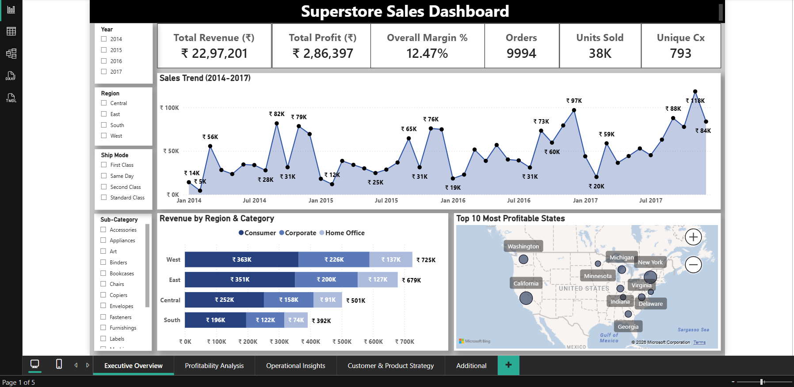

## 📋 Project Overview

An end-to-end business intelligence project analyzing **9,994 retail transactions** across 4 years (2014–2017), 17 product sub-categories, and 4 US regions. The analysis identifies a **₹70K–₹90K annual profit recovery opportunity** through strategic discount optimization and product portfolio restructuring.

> ⚠️ **Note:** The ₹70K–₹90K recovery estimate assumes discount reduction does not significantly impact order volumes. Actual recovery depends on price elasticity. An A/B test at 15%, 20%, and current discount levels is recommended before full implementation.

**Tools Used:** Microsoft Excel (Power Query, Pivot Tables, Charts) | Power BI (DAX, Interactive Dashboards)

**Skills Demonstrated:** Data Cleaning | ETL | Exploratory Data Analysis (EDA) | DAX Measures | BCG Matrix Framework | Customer Segmentation | Business Recommendations

---

## 🎯 Business Problems Identified

| # | Problem | Impact |
|---|---------|--------|
| 1 | Overall profit margin of only 12.47% despite ₹22.97L revenue | Profitability crisis |
| 2 | Strong negative correlation (R²=0.61) between discount depth and profitability | Discount strategy misalignment |
| 3 | 3 sub-categories unprofitable by Overall Margin %; 5 sub-categories unprofitable by Avg Profit Margin % | Product portfolio imbalance |
| 4 | South region contributes only 17% of revenue vs West at 32% | Regional performance gap |
| 5 | 52% of orders are discounted; top revenue customer (Sean Miller) is unprofitable due to heavy discounting | Customer profitability blind spot |

---

## 💡 Key Findings

- **Binders** is the most problematic product: 37.23% average discount, -19.96% avg profit margin, 1,186 out of 1,523 orders are discounted (77.9% discount rate)
- **Tables** loses ₹17,725 annually despite ₹2.06L in revenue — highest absolute loss by Overall Margin %
- **Copiers, Phones, Accessories and Storage** are Stars — high sales volume with positive margins (top performers by both revenue and profitability)
- **Labels, Paper and Envelopes** are Cash Cows — high profit margins (42–44%) but relatively low sales volume; efficient but niche
- **793 unique customers** placed 9,994 orders — avg 12.6 orders per customer, indicating strong retention
- **7,655 customer records** belong to the 11+ orders segment — the loyalty base generating ₹2,31,143 in combined profit
- **Top revenue customer (Sean Miller):** ₹25,043 revenue but -₹1,981 net loss — 13 of 15 orders heavily discounted
- **Most profitable customer (Tamara Chand):** ₹8,981 profit on ₹19,052 revenue — only 4 of 12 orders discounted (33%)
- **California and New York** account for approximately 33% of total revenue combined (₹7,69,000)
- **Profitability varies by measurement method:** Overall Margin % and Average Profit Margin % tell different stories — the Delta column bridges the gap (see Data Cleaning and DAX sections)

---

## 📊 Dashboard Overview (5 Pages)

### Page 1: Executive Overview


Six KPI cards at a glance: Total Revenue (₹22,97,201), Total Profit (₹2,86,397), Overall Margin % (12.47%), Orders (9,994), Units Sold (38K), and Unique Customers (793). Includes interactive slicers for Year, Region, Ship Mode, and Sub-Category. Sales trend (2014–2017), Revenue by Region & Category bar chart, and Top 10 Most Profitable States map with Sales and Margin % in tooltips.

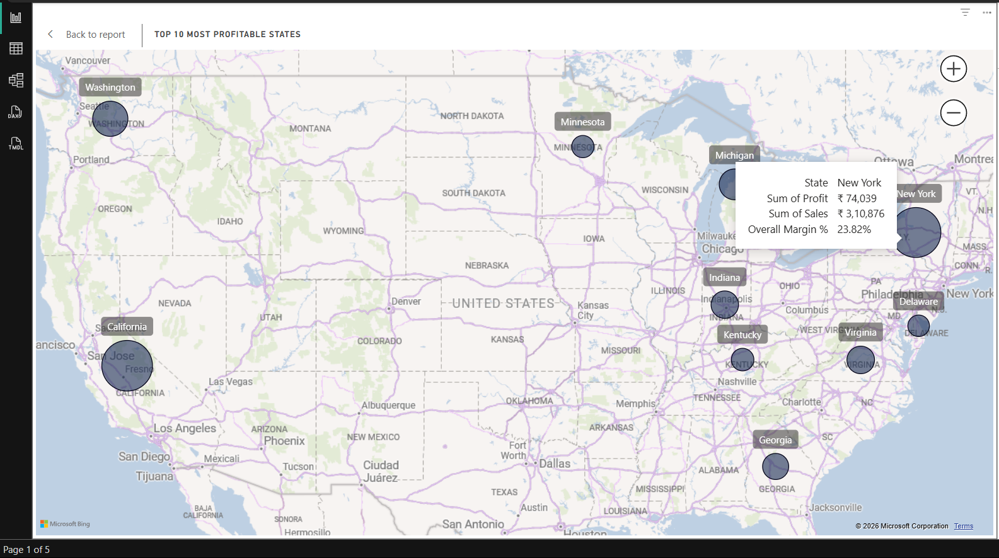

---

### Page 2: Profitability Analysis
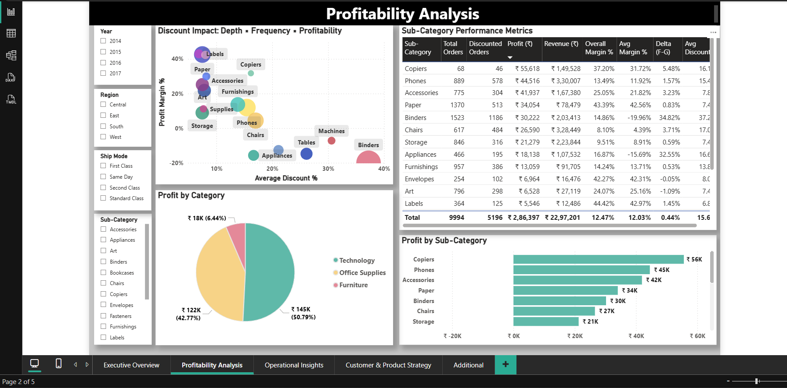

Three-dimensional discount impact bubble chart (depth × frequency × profitability), Sub-Category Performance Metrics table with Delta column (using Visual Calculation), Profit by Category pie chart, and Profit by Sub-Category bar chart with conditional formatting (green = profit, red = loss).

**Bubble Chart Insight:** Products in the bottom-right zone (high discount depth + negative margin) — Binders, Tables, Machines — are the priority targets for intervention.

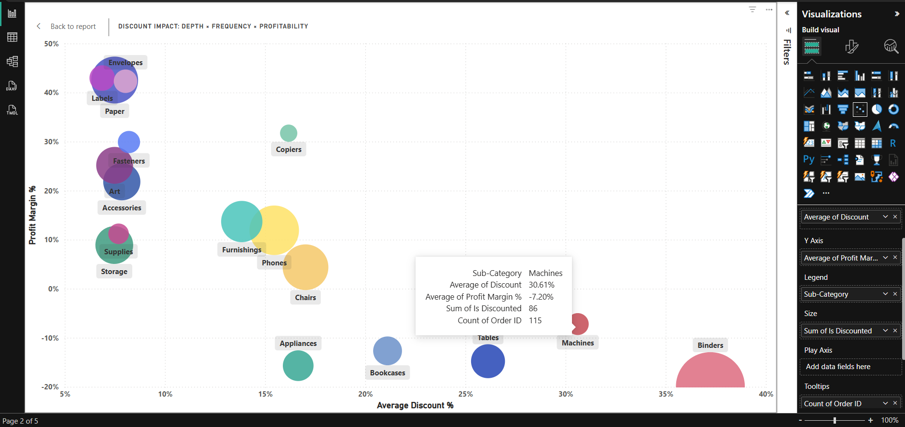

**Sub-Category Performance Metrics table** shows Total Orders, Discounted Orders, Profit, Revenue, Overall Margin %, Avg Margin %, Delta (F-G), and Avg Discount % for all 17 sub-categories.

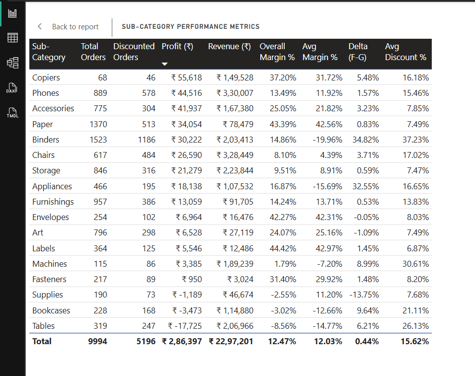

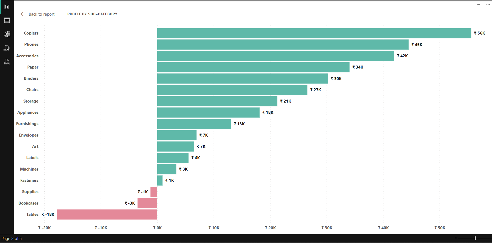

---

### Page 3: Operational Insights
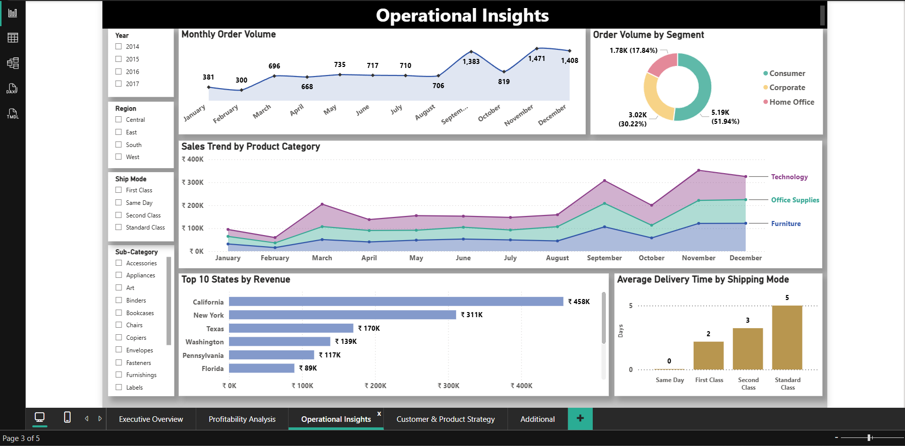

Monthly order volume trend (growth from 381 in January to 1,471 in November peak), customer segment distribution donut chart (Consumer 51.94%, Corporate 30.22%, Home Office 17.84%), sales trend by product category (Technology growing fastest), Top 10 states by revenue, and average delivery time by shipping mode.

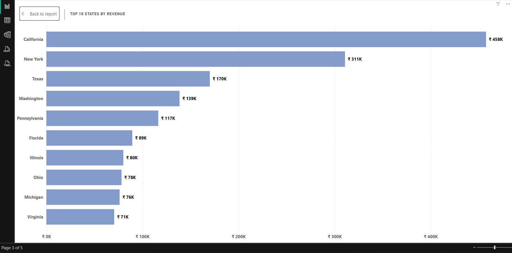

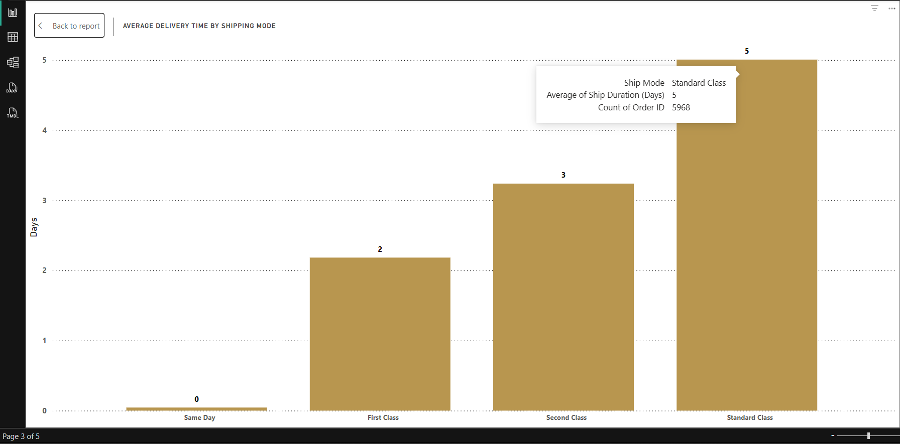

**Key operational finding:** Geographic region does not significantly impact shipping duration — ship mode selection is the primary driver (Same Day: 0 days, First Class: 2 days, Second Class: 3 days, Standard: 5 days).

---

### Page 4: Customer & Product Strategy
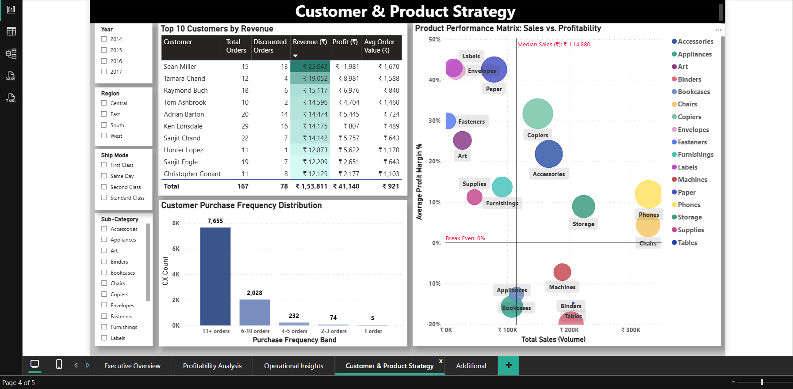

Top 10 customers by revenue with Discounted Orders column revealing per-customer discount dependency, Customer Purchase Frequency Distribution chart, and BCG Product Performance Matrix.

**BCG Matrix methodology:**
- **X-axis threshold:** Median Sales by Sub-Category = ₹1,14,880 — calculated using the `MEDIANX` DAX function (data-driven, not manually set). Robust to outliers unlike a simple average.
- **Y-axis threshold:** 0% profit margin (Break-Even) — the universal business standard for separating profitable from unprofitable products.

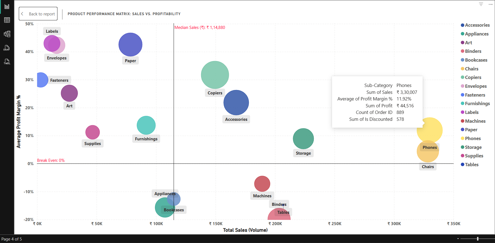

**BCG Quadrant Summary:**

| Quadrant | Products | Strategy |
|----------|----------|----------|
| ⭐ STARS (High Sales, Positive Margin) | Copiers, Phones, Accessories, Storage, Chairs* | Invest & grow |
| 🐄 CASH COWS (Low Sales, High Margin) | Labels, Paper, Envelopes, Fasteners, Art | Maintain; bundle with Stars |
| ❓ QUESTION MARKS (High Sales, Negative Avg Margin) | Binders, Tables, Machines | Fix pricing urgently or discontinue |
| 🐕 DOGS (Low Sales, Negative Avg Margin) | Bookcases, Appliances, Supplies | Phase out |

*Chairs is borderline — high volume but thin margin (4.39% avg). Monitor closely.

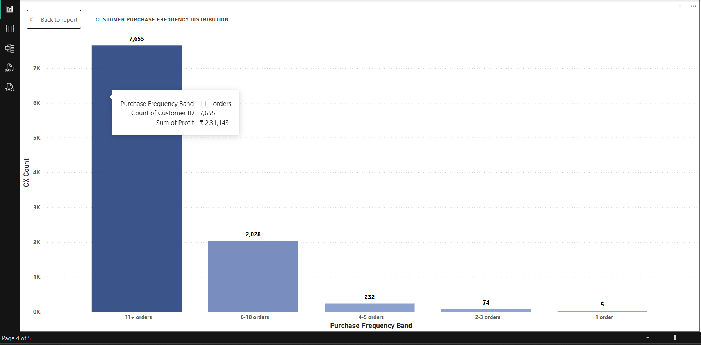

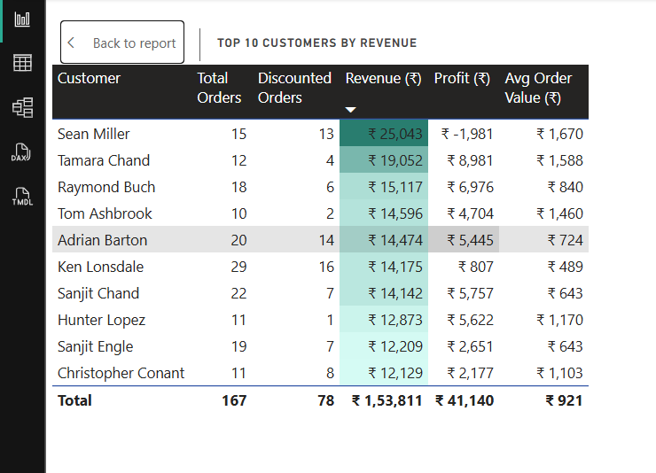

---

### Page 5: Additional Tables
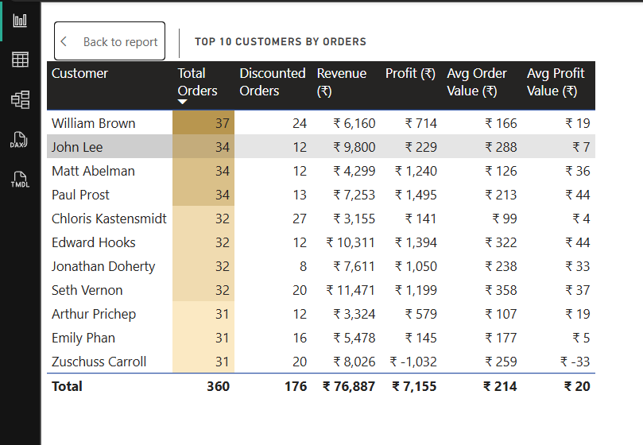

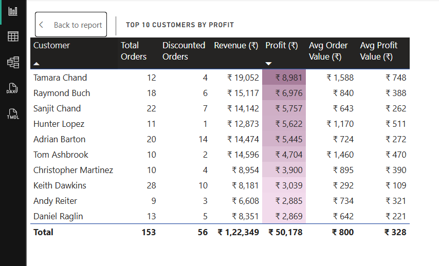

Top 10 customers ranked by total orders and by profitability. The Discounted Orders column in both tables reveals discount dependency per customer. Key contrast: William Brown (37 orders, 24 discounted) vs Tamara Chand (12 orders, 4 discounted — most profitable).

---

## 🔧 Data Cleaning Process

### Raw Data Issues Found

| Issue | Description | Fix Applied |
|-------|-------------|-------------|
| Date format | Order Date and Ship Date stored as text in mixed formats (MM-DD-YYYY and M/D/YYYY), causing negative ship duration calculations | Data tab → Text to Columns → MDY format (applied to both columns separately) |
| Postal Code | Leading zeros missing for 4-digit codes (e.g., 6789 instead of 06789) | Power Query custom column: `= Text.PadStart(Text.From([Postal Code]), 5, "0")` |
| Data types | Multiple columns loaded with incorrect data types after import | Power Query type conversions applied per column |

### Why Text to Columns (Not Power Query Locale) for Dates

Power Query's locale-based date parsing caused negative ship duration values because it misinterpreted the day/month positions in the mixed-format dates. Text to Columns in Excel allows manual MDY specification, fixing the formats at source before loading into Power Query. This is documented in the before/after screenshots below.

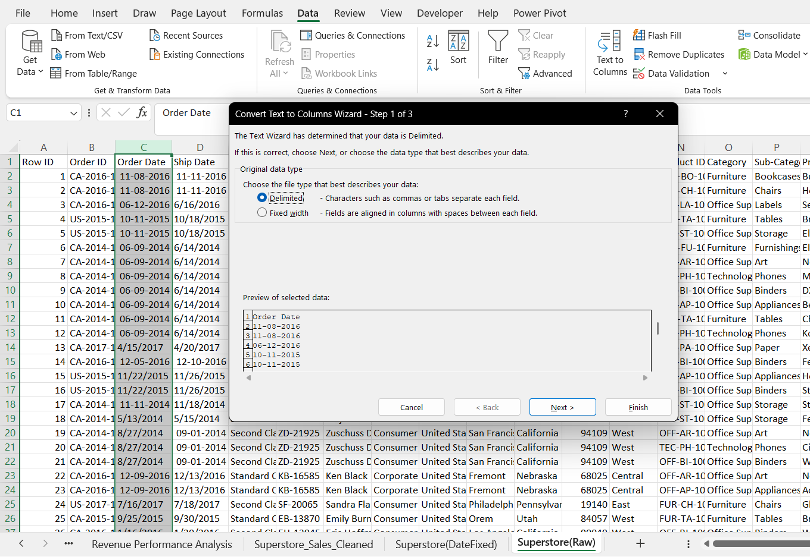

**Before cleaning** — Order Date recognized as text (filter shows individual date strings mixed with years):

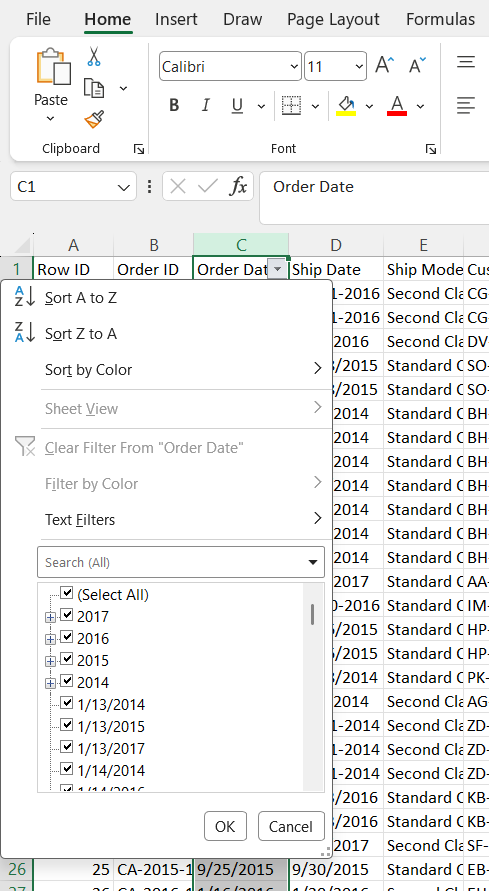

**After cleaning** — Order Date recognized as proper Date type (filter groups cleanly by year only, sort options change to "Oldest to Newest"):

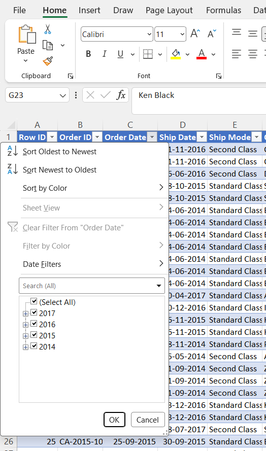

### Power Query Applied Steps

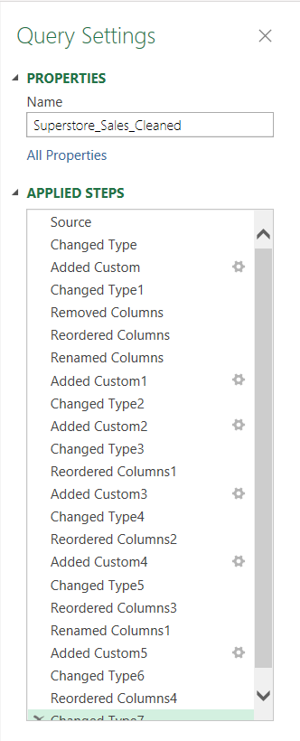

The Applied Steps panel documents every transformation: Source → Changed Type → Added Custom (×5 calculated columns) → Changed Type (data type corrections) → Removed Columns → Reordered Columns → Renamed Columns. The final step includes the `Is Discounted` binary flag column renamed and typed as Whole Number.

### Cleaned Dataset Sample

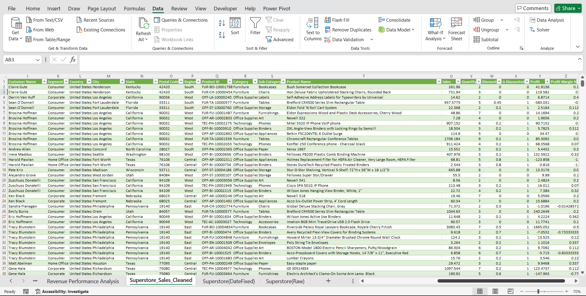

### Calculated Columns Added via Power Query

| Column Name | Power Query Formula | Purpose |
|-------------|---------------------|---------|
| Profit Margin % | `= [Profit] / [Sales]` | Per-transaction profitability ratio |
| Order Year | `= Date.Year([Order Date])` | Enables year-based time filtering |
| Order Month | `= Date.MonthName([Order Date])` | Enables seasonal pattern analysis |
| Ship Duration (Days) | `= Duration.Days([Ship Date] - [Order Date])` | Shipping efficiency measurement |
| Is Discounted | `= if [Discount] > 0 then 1 else 0` | Binary flag for accurate discount frequency count |

---

## 📐 DAX Measures & Calculated Columns

All custom measures and calculated columns are organized under a **DAX display folder** in the Power BI data model. Each measure includes a written description visible on hover in the Data pane — a documentation best practice for team environments.

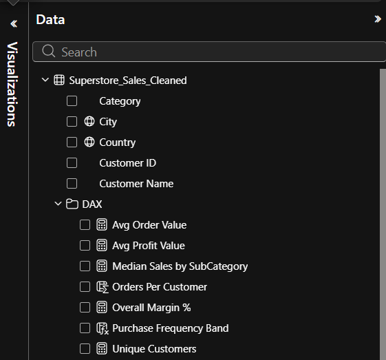

### Summary Table

| Name | Type | Formula (simplified) | Purpose |
|------|------|----------------------|---------|
| Overall Margin % | Measure | `DIVIDE(SUM(Profit), SUM(Sales))` | Revenue-weighted business margin (12.47%) |
| Avg Order Value | Measure | `DIVIDE(SUM(Sales), COUNT(Row ID))` | Average revenue per transaction |
| Avg Profit Value | Measure | `DIVIDE(SUM(Profit), COUNT(Row ID))` | Average profit per transaction |
| Median Sales by SubCategory | Measure | `MEDIANX(VALUES(Sub-Category), CALCULATE(SUM(Sales)))` | Dynamic BCG matrix X-axis threshold (₹1,14,880) |
| Unique Customers | Measure | `DISTINCTCOUNT(Customer ID)` | Count of unique customers (793) |
| Orders Per Customer | Calculated Column | `CALCULATE(COUNT(Row ID), ALLEXCEPT(table, Customer ID))` | Lifetime order count per customer (row-level) |
| Purchase Frequency Band | Calculated Column | `SWITCH(TRUE(), ...)` | Customer loyalty segmentation into 5 bands |

> Full formula documentation with explanations, reasoning, and interview answers available in [`Documentation/DAX_Measures.md`](Documentation/DAX_Measures.md)

### Delta Column (Visual Calculation — Power BI)

The Delta column in the Sub-Category Performance Metrics table on Page 2 was created using **New Visual Calculation → Custom** under the Home ribbon's Calculations tab in Power BI. It is a visual-level calculation, not a data model measure, so it does not appear in the Data pane or DAX folder.

**Formula:** `= [Overall Margin %] - [Avg Margin %]`

**What it reveals:**
- **Positive delta:** A sub-category's large orders have better margins than its average orders (e.g., Copiers +5.48% — premium bulk orders)
- **Negative delta:** Large orders are more heavily discounted than small ones, pulling overall margin below the per-transaction average (e.g., Supplies -13.75%)
- **Near-zero delta:** Consistent margins regardless of order size (e.g., Envelopes -0.05%)

**In Excel:** The Delta column in the Profitability Analysis tab is a plain formula `=D4-E4` placed adjacent to the pivot table — not a calculated field. Excel calculated fields aggregate incorrectly for percentage subtraction at the row level, so a direct cell reference formula gives precise, reliable results.

---

## 📈 Excel Analysis

The Excel workbook contains multiple analysis sheets, each addressing a specific business question.

### Profitability Analysis Tab

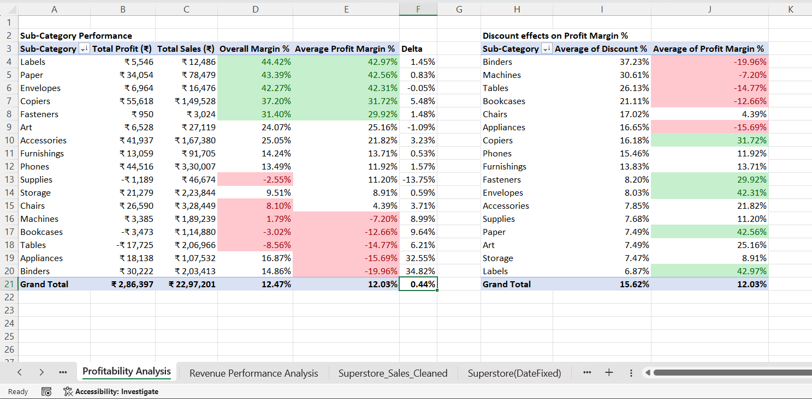

**Left table:** Sub-category performance comparing Overall Margin % (Total Profit ÷ Total Sales) vs Average Profit Margin % (average of all individual transaction margins) with the Delta column. Grand Total: Overall 12.47%, Average 12.03%, Delta +0.44% — indicating that higher-value orders in this dataset tend to have marginally better margins.

**Right table:** Discount effects showing Average Discount % alongside Average Profit Margin % per sub-category, sorted by discount depth. The top 4 most-discounted sub-categories (Binders 37.23%, Machines 30.61%, Tables 26.13%, Bookcases 21.11%) all have negative average profit margins.

**Why Avg Profit Margin % (not Overall Margin %) for comparison with Avg Discount %:**
Both metrics are transaction-level averages, making the comparison consistent (apples-to-apples). Mixing Overall Margin % (revenue-weighted) with Average Discount % (simple average) would create a methodological mismatch and distort the correlation analysis.

### Discount Impact Scatter Plot

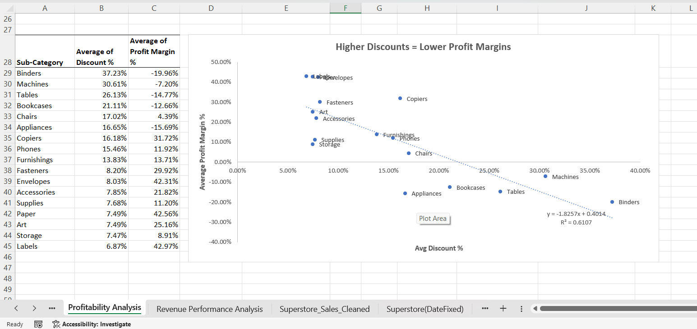

**Trendline equation:** y = -1.8257x + 0.4014 | **R² = 0.6107**

This confirms that 61% of the variance in profit margin across sub-categories is explained by discount depth. The remaining 39% is attributable to cost structure, product mix, and other factors. This is why discount reduction alone may not fully resolve profitability for all products — a COGS audit is recommended as a future step.

### Discount Frequency Analysis (Corrected)

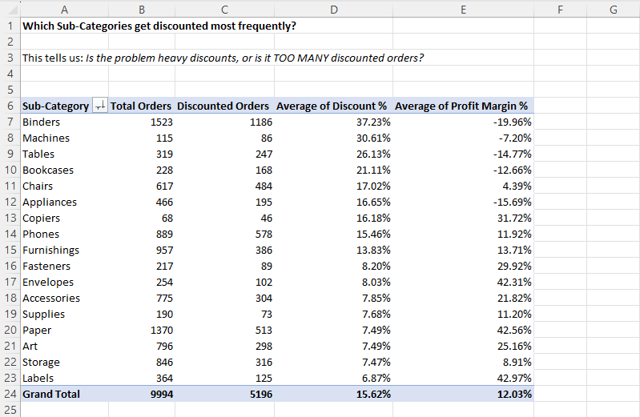

Using the `Is Discounted` binary flag, the correct count of discounted orders is **5,196 out of 9,994 (52%)**. The original pivot incorrectly counted all 9,994 rows as discounted. The corrected table now shows both Total Orders and Discounted Orders per sub-category, enabling accurate frequency analysis.

**Key finding:** Binders has 1,186 discounted orders out of 1,523 total (77.9% of orders are discounted), with 37.23% average discount depth — making it both the highest-frequency and highest-depth discounting problem in the dataset.

### Revenue Performance Analysis Tab

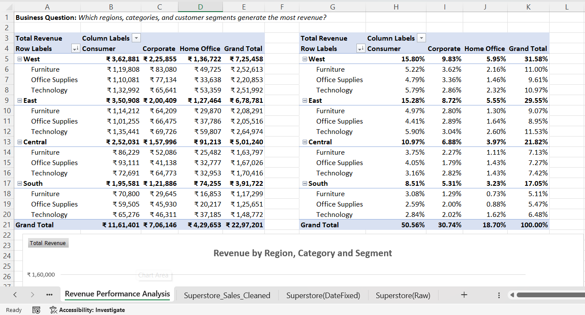

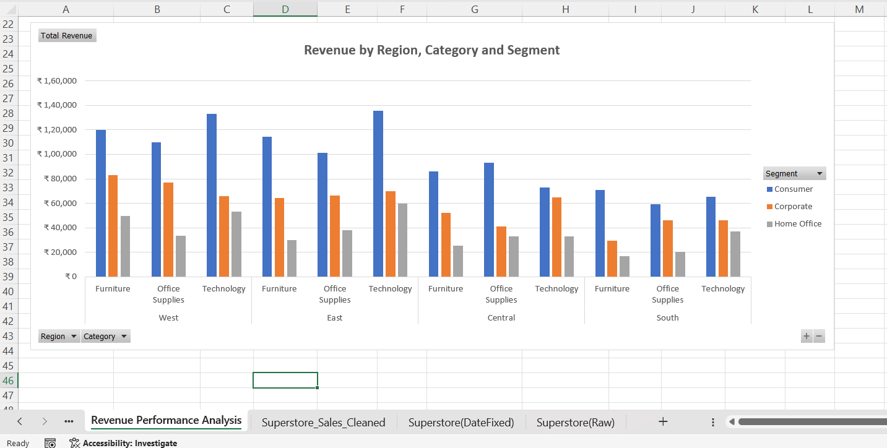

Cross-tab showing Revenue by Region × Category × Customer Segment with percentage contribution to total. West leads (31.58%), followed by East (29.55%), Central (21.82%), and South (17.05%). Consumer segment dominates across all regions (50.56% of total revenue).

### Sales Trends Over Time

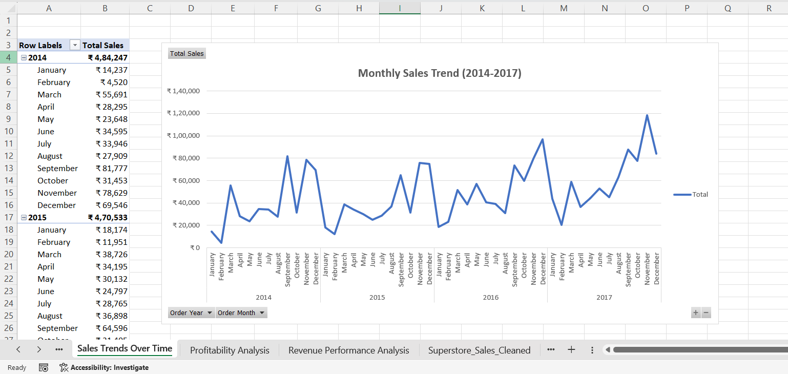

Year-over-year performance: 2014 ₹4,84,247 (base year) → 2015 ₹4,70,533 (-2.83%) → 2016 ₹6,09,206 (+29.47%) → 2017 ₹7,33,215 (+20.36%). Consistent seasonal peaks in September and November across all years.

### Shipping Efficiency Analysis

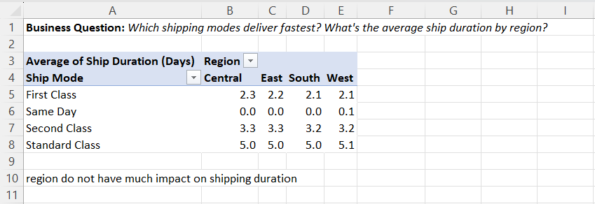

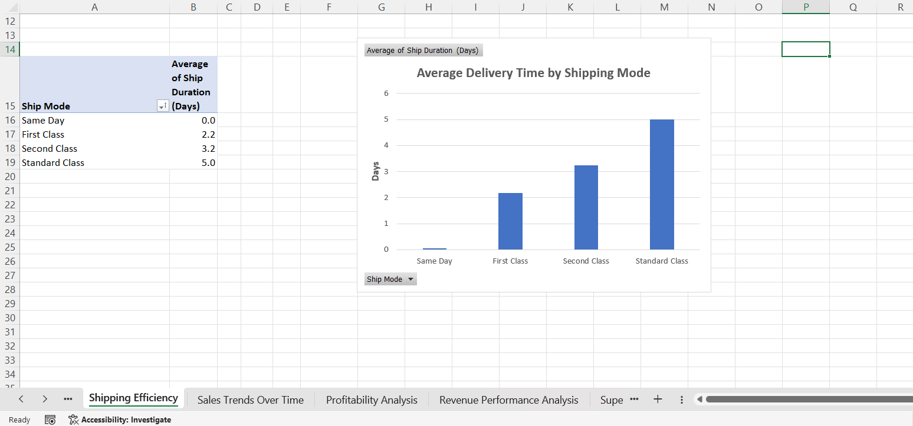

Cross-tab analysis confirms that geographic region has minimal impact on shipping duration — ship mode is the primary driver. Standard Class (5 days) accounts for the majority of orders (5,968 out of 9,994).

---

## 💼 Strategic Recommendations

### Immediate Actions (0–30 Days)

**1. Cap discounts at 15% for Binders, Machines, Tables, and Bookcases**

The 15% threshold is data-informed: sub-categories with discounts below 15% (Labels 6.87%, Paper 7.49%, Envelopes 8.03%, Fasteners 8.20%) are all profitable. Chairs, the highest-discounted sub-category still in positive margin territory, sits at 17.02% — suggesting 15% as a reasonable ceiling.

- Binders: 1,186 discounted orders at avg 37.23% → cap to 15% → estimated ~₹38,000 recovery
- Tables: ₹17,725 current loss → discount reduction → estimated ~₹18,000–₹21,000 recovery
- Machines + Bookcases: combined ~₹8,000–₹12,000 recovery
- **Total estimated recovery: ₹70K–₹90K annually** (subject to A/B testing)

**2. Review Sean Miller account pricing**

₹25,043 revenue, -₹1,981 net loss. 13 of 15 orders were discounted. This customer is the highest-revenue customer in the dataset but generates a net loss. Recommended action: switch to standard pricing on next renewal or renegotiate terms. Flag other high-revenue, low-profit accounts using the Top 10 Customers by Revenue vs Top 10 by Profit comparison (Page 4 and Page 5).

### Medium-Term Actions (1–6 Months)

**3. BCG Portfolio Restructuring**

- **STARS — Copiers, Phones, Accessories, Storage:** Increase marketing investment and ensure consistent inventory. These drive both revenue and profit.
- **CASH COWS — Labels, Paper, Envelopes, Fasteners, Art:** Maintain current approach. Consider cross-selling or bundling with Stars products to increase basket size without additional discounting.
- **QUESTION MARKS — Binders, Tables, Machines:** These have high customer demand but are losing money. Priority: implement discount cap (Action 1). If margin does not improve within 6 months, evaluate discontinuation.
- **DOGS — Bookcases, Appliances, Supplies:** Low demand, negative or near-zero margins. Recommend phasing out within 6 months. Monitor whether removal impacts overall basket size.
- **Chairs:** Borderline Star — high volume but only 4.39% avg margin. Monitor the impact of any discount policy changes on Chairs specifically.

**4. South Region Growth Investigation**

South contributes 17.05% of total revenue vs West at 31.58%. South Technology specifically underperforms (6.48% of total vs West Technology at 10.97%). Recommended: conduct market research to identify barriers (distribution, competition, awareness) before committing budget. Set 20% revenue share as a 12-month target.

**5. Seasonal Inventory and Staffing Optimization**

Monthly Order Volume (Page 3) shows consistent seasonal peaks in September (1,383 orders) and November (1,471 orders) across all four years, with consistent troughs in January (381) and February (300). Recommended: increase inventory levels and operational capacity in September–November; reduce carrying costs in January–February.

**6. First Class Shipping Promotion**

60% of orders use Standard Class (5-day delivery). First Class delivers in 2 days at presumably a moderate premium. Promoting First Class as the recommended option for customers who need faster delivery could improve satisfaction without the cost of Same Day shipping (reserved for urgent, high-value orders only).

### Future Enhancements

- Calculate COGS per unit to distinguish between discount-driven losses and structurally unprofitable products
- Build a price elasticity model to determine optimal discount thresholds before implementing the cap
- Incorporate returns and refunds data (if available) to calculate true net revenue
- Extend analysis to customer lifetime value (CLV) modelling using the purchase frequency segmentation already built

---

## 🎓 Key Learnings

1. **Data quality must be verified before Power Query:** Incorrect date text formats caused negative ship duration values. The fix required Text to Columns in Excel (manual MDY specification) before loading into Power Query — locale-based parsing alone was insufficient for this mixed-format dataset.

2. **Metric selection changes the story:** Overall Margin % (12.47%) and Average Profit Margin % (12.03%) are both correct but answer different questions. Overall Margin % is revenue-weighted and appropriate for executive reporting. Average Profit Margin % treats every transaction equally and is better for identifying per-order profitability patterns. Using both — and measuring the Delta — revealed that Binders appears overall-profitable but loses money on 77.9% of individual transactions.

3. **Correlation explains part of the picture, not all of it:** R²=0.61 confirms discounts are the primary driver of margin erosion, but 39% of variance is unexplained — likely COGS differences across products. A complete fix requires both a discount cap and a cost audit.

4. **Binary flags over raw counts for accuracy:** Using the `Is Discounted` binary column correctly identified 5,196 discounted orders (not 9,994). The original count included all rows regardless of discount value, which would have made frequency analysis meaningless. This correction also changed the bubble chart sizes and the interpretation of which products are most frequently discounted.

5. **Data-driven thresholds are defensible; guesses are not:** The BCG matrix X-axis uses MEDIANX across 17 sub-category totals (₹1,14,880) rather than a manually chosen value. The Y-axis uses 0% (universal break-even). Both can be explained and defended to any interviewer with a clear analytical rationale.

6. **High revenue ≠ high profit at the customer level:** Sean Miller (highest revenue customer) generates a net loss. Tamara Chand (most profitable customer) generates 47% profit margin on lower revenue. Customer-level profitability analysis requires looking beyond topline revenue — the Discounted Orders column added to all customer tables makes this comparison immediate and visible.

---

## 📁 Repository Structure

```
Superstore-Sales-Analysis/
│
├── README.md                              ← Project homepage (this file)
│
├── Screenshots/
│   ├── PowerBI/                           ← 15 Power BI dashboard screenshots
│   │   ├── PBI_Page1_Executive_Overview.png
│   │   ├── PBI_Page1_Map_Profitable_States.png
│   │   ├── PBI_Page2_Profitability_Analysis.png
│   │   ├── PBI_Page2_Bubble_Chart_Focus.png
│   │   ├── PBI_Page2_SubCategory_Table_Focus.png
│   │   ├── PBI_Page2_Profit_by_SubCategory.png
│   │   ├── PBI_Page3_Operational_Insights.png
│   │   ├── PBI_Page3_Top10_States_Revenue.png
│   │   ├── PBI_Page3_Shipping_Mode_Analysis.png
│   │   ├── PBI_Page4_Customer_Product_Strategy.png
│   │   ├── PBI_Page4_BCG_Matrix_Focus.png
│   │   ├── PBI_Page4_Customer_Frequency.png
│   │   ├── PBI_Page4_Top10_Customers_Revenue.png
│   │   ├── PBI_Page5_Top10_Customers_Orders.png
│   │   └── PBI_Page5_Top10_Customers_Profit.png
│   │
│   ├── Excel/                             ← 9 Excel analysis screenshots
│   │   ├── Excel_Profitability_Analysis_Delta.png
│   │   ├── Excel_Scatter_Discount_vs_Margin.png
│   │   ├── Excel_Discount_Strategy_Corrected.png
│   │   ├── Excel_Discount_Bubble_Chart.png
│   │   ├── Excel_Revenue_Performance_Pivot.png
│   │   ├── Excel_Revenue_by_Region_Chart.png
│   │   ├── Excel_Sales_Trends_2014_2017.png
│   │   ├── Excel_Shipping_Efficiency_CrossTab.png
│   │   └── Excel_Shipping_Delivery_Chart.png
│   │
│   └── DataCleaning/                      ← 5 data cleaning + 2 DAX screenshots
│       ├── DC_TextToColumns_Wizard.png
│       ├── DC_OrderDate_Before_Cleaning.png
│       ├── DC_OrderDate_After_Cleaning.png
│       ├── DC_PowerQuery_Applied_Steps.png
│       ├── DC_Cleaned_Dataset_Sample.png
│       ├── DC_DAX_Folder_Organization.png
│       └── DC_DAX_Measure_Description.png
│
├── Data/
│   ├── Superstore.xlsx                    ← Complete Excel workbook (all analysis tabs)
│   └── Superstore_Dashboard.pbix          ← Power BI dashboard file
│
└── Documentation/
    └── DAX_Measures.md                    ← Full DAX formula documentation
```

---

## 📬 Contact

**Aman Lall**
- LinkedIn: [linkedin.com/in/amanlall94](https://linkedin.com/in/amanlall94/)
- Email: amanlall94@gmail.com

---

*This project was completed as part of a self-directed data analyst portfolio. Dataset: Sample Superstore (publicly available training dataset provided by Tableau/Salesforce for learning purposes).*
